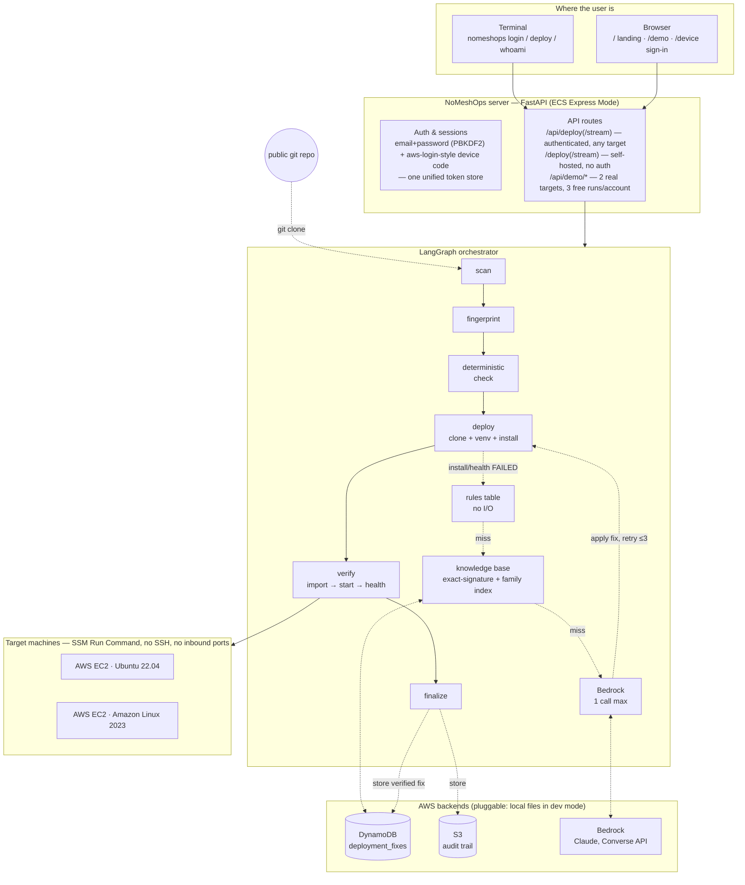

# NoMeshOps — self-healing deployment agent

Fingerprints a target EC2 machine, deploys a Python project on it, and when the deploy fails, fixes it:
**deterministic rules table → DynamoDB knowledge base → Amazon Bedrock (only for genuinely new failures)**.
Every fix is verified for real (install → import → app start → HTTP health check) before it is stored, so the
same error resolves near-instantly the next time it is seen.

## Architecture



Six clouds are supported end to end (`WEB.md` has the full list, proven with real deploys on each);
the hosted demo above only lists the two backed by real EC2 machines it can currently reach — the
rest are simulated in local Docker mode. Stop conditions: at most 3 fix attempts and 1 model call
per run. Repo URLs are checked against an explicit git-host allow-list before anything reaches a
target, and a per-target lock rejects a concurrent deploy on the same machine instead of corrupting it.

## Layout

| path | what |
|---|---|
| `app/graph.py` | the LangGraph graph: scan → fingerprint → deterministic_check → deploy → verify → (lookup_rules → lookup_knowledge → ask_bedrock) → finalize |
| `app/nodes/scan.py` | parse requirements.txt / pyproject.toml / Dockerfile (local shallow clone) |
| `app/nodes/fingerprint.py` | SSM script → structured fingerprint (os, arch, python, pip, venv, git, gcc, package manager) |
| `app/nodes/rules.py` | deterministic rules: pre-deploy predictions + error-pattern → fix table. No network. |
| `app/nodes/signature.py` | error classification + signature hash (error type, package, version, OS, arch, python, normalized message) |
| `app/nodes/deploy.py` | clean clone + venv + fix stages + pip install, over SSM (POSIX sh) |
| `app/nodes/verify.py` | import check → start app → poll health endpoint → stop app |
| `app/nodes/knowledge.py` | DynamoDB exact-signature lookup, family index, success/failure counters |
| `app/nodes/bedrock_fix.py` | Bedrock Converse call, JSON contract, destructive-command filter |
| `app/nodes/store.py` | S3 audit records `attempts/<ts>-<instance>-<run>.json` |
| `app/main.py` | FastAPI: `POST /deploy`, `POST /deploy/stream` (SSE), `/fixes`, `/attempts`, `/check` |
| `cli/demo.py` | colored terminal demo (in-process or against the deployed URL) |
| `scripts/` | `provision.sh`, `launch_targets.sh`, `deploy_ecs_express.sh`, `smoke_phase{1,2,3}.py`, IAM policy |
| `sample_project/` | a FastAPI target with a deliberate failure (push it to your GitHub) |
| `tests/` | offline end-to-end tests with a fake SSM box, fake DynamoDB, scripted Bedrock |

## Setup

```bash
python3 -m venv .venv && .venv/bin/pip install -r requirements.txt
cp .env.example .env            # set AWS_PROFILE / AWS_REGION / LOGS_BUCKET / BEDROCK_MODEL_ID
.venv/bin/python -m pytest -q   # offline tests, no AWS needed
```

### AWS resources (once)

```bash
export AWS_PROFILE=hackathon AWS_REGION=ap-south-1
./scripts/provision.sh                 # DynamoDB table + GSI, S3 bucket -> prints the .env lines
./scripts/launch_targets.sh            # 3 SSM-managed EC2 targets (Ubuntu 22.04 / AL2023 / AL2023 arm64)
```

Bedrock: Anthropic models need the one-time **first-time-use** submission per account (model catalog in the
console). Do this before demo day. Region-appropriate inference profile ids: `apac.anthropic.…` in ap-south-1,
`us.anthropic.…` in us-east-1 — set `BEDROCK_MODEL_ID` accordingly.

Push `sample_project/` to a public GitHub repo; that is the `--repo` you deploy.

## Run

```bash
# in-process (local credentials), colored output
.venv/bin/python -m cli.demo deploy --repo https://github.com/<you>/nomeshops-sample --instance i-0123...

# API locally
.venv/bin/uvicorn app.main:app --port 8080
curl -s localhost:8080/deploy -H 'content-type: application/json' \
  -d '{"repo_url":"https://github.com/<you>/nomeshops-sample","instance_id":"i-0123..."}' | jq .final_status

# deployed on ECS Express Mode (build -> ECR -> one create-express-gateway-service call -> public HTTPS URL)
LOGS_BUCKET=... ./scripts/deploy_ecs_express.sh
.venv/bin/python -m cli.demo deploy --repo ... --instance ... --url https://<express-url>
# current deployment: https://no-7cbc2123abe543dfae0a7c09f665e2ff.ecs.ap-south-1.on.aws  (GET /health, POST /deploy, POST /deploy/stream)
#   web platform on the same URL: / landing, /demo live 6-cloud picker (2 real targets on this deployment), /device sign-in
# note: a freshly created *.on.aws name can sit in your ISP resolver's negative cache for a while;
#       `curl --resolve <host>:443:<ip>` (ip from `dig +short <host>`) works immediately.
```

Useful flags: `--preempt/--no-preempt` (apply predicted deterministic fixes before the first attempt, default on),
`--start-command`, `--port`, `--health-path`, `--keep-running`.

## Smoke tests (each phase's gate, against real AWS)

```bash
.venv/bin/python scripts/smoke_phase1.py --instance i-A --repo <sample repo>
.venv/bin/python scripts/smoke_phase2.py                              # offline part
.venv/bin/python scripts/smoke_phase2.py --instance i-A --repo <repo> # + seeded knowledge-base hit
.venv/bin/python scripts/smoke_phase3.py --repo <repo> --instance-a i-A --instance-b i-B
```

Phase 3 is the demo beat: novel error → Bedrock → verified → stored, then the same error on a second
instance resolves from DynamoDB with no LLM call. **Instances A and B must share OS / arch / Python minor**
for an exact-signature hit (the signature deliberately includes runtime context). Across platforms the
`family-index` gives a second chance: the other platform's fix is tried and the verification gate decides.

## How a fix runs on the target

Fix commands execute as root under bash. Stage `pre` runs before `git clone` (system bootstrap: git,
python, pip/venv, C toolchain, dev headers). Stage `post` runs after the venv exists and right before
`pip install` (pip upgrades, `sed` edits to requirements.txt, pre-installing a wheel). Every attempt starts
from a fresh clone and venv so a "verified" result is a real reproduction. Bedrock output must be one JSON
object; commands matching a destructive-pattern deny-list are rejected before they ever reach SSM.

## Stop conditions

`MAX_FIX_ATTEMPTS` (default 3) fix retries per run and `MAX_LLM_ATTEMPTS` (default 1) Bedrock calls.
Then a structured failure report with the full attempt history. No indefinite looping.

## Data model

DynamoDB `deployment_fixes`: PK `error_signature`; GSI `family-index` on `error_family`; attributes
`fix_command, description, source, error_type, package, package_version, os, architecture, python_version,
success_count, failure_count, first_seen_at, last_verified_at`.

S3: `attempts/<timestamp>-<instance>-<run>.json` with fingerprint, scan, predicted issues, every attempt with
raw output tails, the fix chain and its source, verification results, and the event timeline. SSM also
writes full command output under `ssm-output/`.

## Scope (deliberate)

Built against controlled, tagged EC2 instances (`nomeshops=target`), not arbitrary customer infrastructure.
No Cognito, no web dashboard, no Step Functions, no pgvector: exact-signature DynamoDB is enough to prove
"gets smarter with every error".

## Local mode (no AWS account needed)

Every backend is pluggable, so the whole loop runs on a laptop with Docker containers standing in for EC2:

| concern | AWS (default) | local |
|---|---|---|
| running commands on the target | SSM Run Command (`EXECUTOR=ssm`) | `docker exec` into a container (`EXECUTOR=docker`) |
| knowledge base | DynamoDB (`KB_BACKEND=dynamodb`) | `.nomeshops/fixes.json` (`KB_BACKEND=local`) |
| audit log | S3 (`STORE_BACKEND=s3`) | `.nomeshops/attempts/` (`STORE_BACKEND=local`) |
| fix generation | Bedrock (`LLM_BACKEND=bedrock`) | Anthropic API (`LLM_BACKEND=anthropic`, needs `ANTHROPIC_API_KEY`) or `none` |

```bash
cp .env.local.example .env
./scripts/local_targets.sh          # 6 targets: Ubuntu 22.04/24.04, Amazon Linux 2023, Debian 12, Rocky Linux 9, Alpine 3.20
.venv/bin/python -m cli.demo deploy --repo https://github.com/SibgathKhan777/nomeshops-sample.git --instance nomeshops-ubuntu22
./scripts/local_targets.sh --stop
```

**Measured locally, post-hardening (2026-09-19).** Full end-to-end suite on the two containers, 11 of 11
scenarios correct. `LLM_BACKEND=none`, so every resolution below came from the rules table or the knowledge base:

| scenario | what the loop did | time |
|---|---|---|
| clean project | no predicted issues, installs and verifies first try | 22.3 s |
| typo dependency, Ubuntu | KB exact hit → `sed` fix → verified | 32.0 s |
| typo dependency, Amazon Linux | different exact signature → **family-index** hit from the Ubuntu fix → verified → stored under its own signature | 37.3 s |
| psycopg2 source build | rules predicted the missing libpq headers and pre-installed them → verified first try | 70.7 s |
| `pyproject.toml`-only manifest | parsed and deployed with no `requirements.txt` | 44.8 s |
| Flask app | start command auto-detected from the manifest | 14.4 s |
| app crashes at startup | verification catches it, clean failure, nothing learned | 21.0 s |
| undeclared runtime import | app fails to start, `ImportError` on the exact missing module | 72.8 s |
| wrong health path | health gate fails, run reported as failed | 79.0 s |
| bad repo URL | `GitError`, stops immediately, no fix ladder, no model call | 3.1 s |
| unreachable target | `UnreachableTarget`, stops immediately | 1.4 s |

**Cross-project transfer.** A separate project inside the container, sharing only the faulty dependency, resolved
from the fix learned on the sample project: **exact KB hit in 1 ms**, verified in 24.3 s, counter incremented rather
than a duplicate row written.

A bare Ubuntu container costs roughly 2 extra minutes on its first run while the rules table installs python and git.
Signatures, scripts and the verification gate are identical between local and AWS mode; only the transport differs,
so a fix learned on AWS resolves locally and vice versa.

## Demo runbook

The sample repo `https://github.com/SibgathKhan777/nomeshops-sample` ships the fast-failing typo variant
(`reqests==2.31.0`), which is the one to film: the whole three-beat story fits in about 80 seconds.

**On real AWS (ap-south-1, 2026-09-18/19).** These runs predate the hardening in `evals/`, so read the times as the
shape of the loop rather than as post-fix benchmarks:

| step | box | what happened | time |
|---|---|---|---|
| 1 | Ubuntu 22.04 A | `No matching distribution for reqests` in 10 s → rules miss → KB miss (253 ms) → **Bedrock** 2.3 s → `sed` typo fix → install → import+start+health 200 → fix stored | 42 s |
| 2 | Ubuntu 22.04 B | same signature → **KB hit in 301 ms** → same fix → verified → success_count 2, **0 LLM calls** | 34 s |
| 3 | AL2023 (py 3.9) | rules pre-installed git+pip → verified first try, 0 fixes | 58 s |

The deployed orchestrator ran the same Ubuntu B deploy end to end (SSM + DynamoDB hit in 45 ms + S3) in 29.6 s using
only its ECS task role, with no local credentials involved.

Post-hardening numbers for the same three beats, measured locally, are in the Local mode table above. The two Ubuntu
boxes must share OS / arch / Python minor for the exact-signature hit; across platforms the family index carries the
fix instead, with verification still acting as the gate.

Other variants in the sample repo: `variants/requirements-numpy-old-pin.txt` (numpy 1.19.5 on Python 3.10) takes
~230 s because pip spends ~3 min trying to compile numpy before failing, same story but too slow for a short video;
`variants/requirements-rules-path.txt` (psycopg2 → `pg_config not found`) shows the deterministic path.

Evidence for the video: `python -m cli.demo fixes list` (DynamoDB rows with `source=bedrock`, `success_count`),
`python -m cli.demo attempts` (S3 objects), and the SSM Run Command history in the console.

Tear down: `AWS_REGION=ap-south-1 ./scripts/launch_targets.sh --terminate` (terminates every instance tagged `nomeshops=target`).
